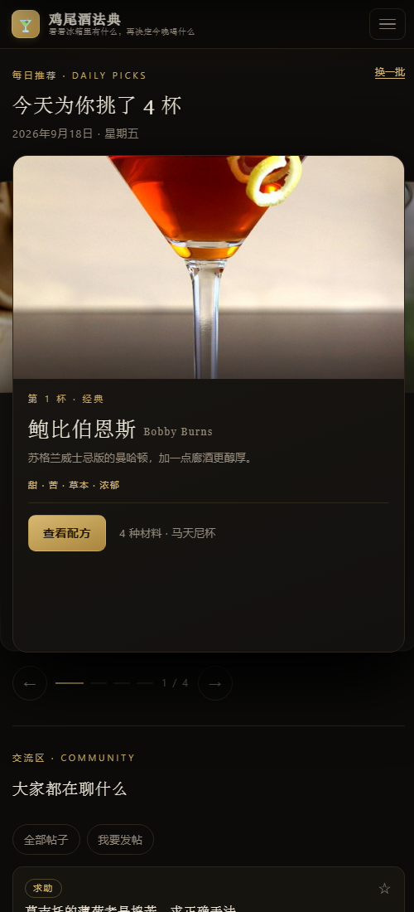

# 鸡尾酒法典 · 调酒灵感

一个帮你决定「今晚喝什么」的调酒配方网站。

打开网页，看看冰箱里有什么，就知道今晚能调哪一杯；也可以按口味挑、按材料找，或者让首页每天替你选四杯。

**在线访问：** https://cocktail-d1gk02vdl123a2e05-1490357990.tcloudbaseapp.com

手机和电脑都能用，不注册也能浏览全部内容。

---

## 这个网站解决什么问题

想在家调酒的人通常卡在三个地方：

1. **不知道调什么** —— 配方散落在视频、帖子、书里，看的时候记不住，想调的时候找不到。
2. **买了酒用不完** —— 一瓶利口酒只能用两三次，剩下的不知道还能配什么。
3. **不敢改配方** —— 经典配方比例很讲究，凭感觉调容易翻车。

这个网站把这三件事放在了一起：一个整理好的配方库、一个「按我手头的材料找酒」的工具，以及一个可以互相问问题的地方。

---

## 功能

### 配方库 · 144 款

收录 135 款经典鸡尾酒和 9 款特调，每杯都写清楚用多少毫升、什么杯子、几步做完，酒感和场合一目了然。

搜索支持**中文名、英文名、各种中文译名和外号**：搜「琴酒」「毡酒」「杜松子酒」「Gin」都能找到同一瓶酒。还能按基酒、酒感筛选，或者只看自己收藏过的。

### 我有啥 · 按材料找酒

勾一勾你手头有的材料，网站会把配方分成三档摆出来：

- **现在就能调**
- **差 1 种材料**
- **差 2 种材料**

顺便告诉你「再买哪一瓶，能多解锁几杯」。材料库里预置了 190 多种常见材料，从基酒、利口酒到水果、糖浆、装饰物都有。

### 想喝啥 · 按口味挑

不想研究配方，就想喝点酸酸甜甜带气泡的？在标签里点几下（甜、酸、苦、气泡、长饮、短饮、微醺、夏日……），符合条件的酒就筛出来了。拿不定主意还可以让它随机抽一杯。

### 每日推荐

首页每天自动挑四杯，用大图卡片叠着展示，左右切换浏览。同一天刷新页面推荐不会变，第二天自动换一批；也可以手动点「换一批」，换过的那组会记住。

### 交流区

发帖求助、晒作品、聊器材都行。帖子可以带最多 6 张图，可以打上「这杯是哪个酒」的标签，也能收藏和按热度 / 时间排序。

发出去的帖子会先过一遍自动检查（广告、拉群、辱骂这类会拦下来），明显没问题的直接发布。

### 评论、讨论区与勘误

- 每杯酒下面有评论区，可以评论、回复、点赞
- 配方详情页最下方会聚合「聊到这杯酒」的帖子，也可以原地发帖
- 发现配方写错了，任何人都能提交勘误，站长会处理

---

## 怎么用

| 能做到什么 | 游客 | 注册用户 |
| --- | :---: | :---: |
| 浏览配方、材料、评论、交流区 | 可以 | 可以 |
| 收藏配方、勾选自己的材料 | — | 可以 |
| 发帖、评论、点赞 | — | 可以 |
| 发布自己的配方、补充教学视频 | — | 可以 |
| 提交勘误 | — | 可以 |

注册只要一个**邮箱**：填昵称、邮箱，收一封验证码邮件，设个密码就行。昵称可以重复，不用抢。

注册后可以在「我的」里改密码、看自己收藏过的酒和自己发过的内容。

---

## 关于配方图片

配方照片是演示用的，来自公开鸡尾酒数据库 [TheCocktailDB](https://www.thecocktaildb.com/)。少数冷门配方暂时没有照片，会显示成带渐变的 emoji 卡片，不影响使用。

站长可以在后台逐杯换图（贴图片链接或直接上传），换过的图会永久保存，将来也可以整体换成自己拍的照片。

---

## 技术栈

| 部分 | 用了什么 | 简单说 |
| --- | --- | --- |
| 网页界面 | 原生 HTML / CSS / JavaScript | 没有用框架，打开就是几个文件，改起来直观 |
| 网页托管 | 腾讯云静态托管 + GitHub Pages | 两个地址指向同一份代码，互为备份 |
| 后端接口 | 腾讯云开发云函数（Node.js） | 所有读写数据的请求都经过它，数据库不直接暴露给浏览器 |
| 数据库 | PostgreSQL（腾讯云开发 SQL 数据库） | 存配方、材料、账号、帖子、评论 |
| 登录 | 邮箱 + 验证码 + 密码 | 密码用 scrypt 加盐哈希存储，数据库里看不到明文 |
| 邮件 | QQ 邮箱 SMTP | 发注册验证码，不花钱 |
| 内容审核 | 关键词规则 + AI 复核（可选） | 先本地规则过一遍，风险高的转人工 |

想了解这套东西是怎么一步步搭起来的、每个技术是干什么用的，看 [docs/网站建设全记录.md](docs/网站建设全记录.md)。

---

## 在本地打开

不需要安装任何东西：

1. 直接双击 `index.html` 就能看（这时数据存在本机浏览器里）
2. 想在手机上预览：在本文件夹执行 `node serve.js`，用同一个 WiFi 下的手机访问提示的局域网地址

---

## 文档

| 文档 | 给谁看 | 内容 |
| --- | --- | --- |
| [docs/网站建设全记录.md](docs/网站建设全记录.md) | 想搞懂原理的人 | 从零到上线的完整过程、技术原理、每一步改了什么 |
| [docs/上线操作手册.md](docs/上线操作手册.md) | 站长 | 上线后的日常维护、更新网页、备份数据 |
| [docs/邮箱验证码接入指南.md](docs/邮箱验证码接入指南.md) | 站长 | 配置真实发送注册验证码 |
| [cloud/README.md](cloud/README.md) | 站长 | 后端与数据库的部署说明 |

---

## 说明

- 本站是个人项目，内容按公开资料和常见配方整理而成，口味因人而异，欢迎留言纠正。
- **请理性饮酒，未成年人请勿饮酒。** 孕妇、服药期间、需要开车或操作机械时请勿饮酒。
